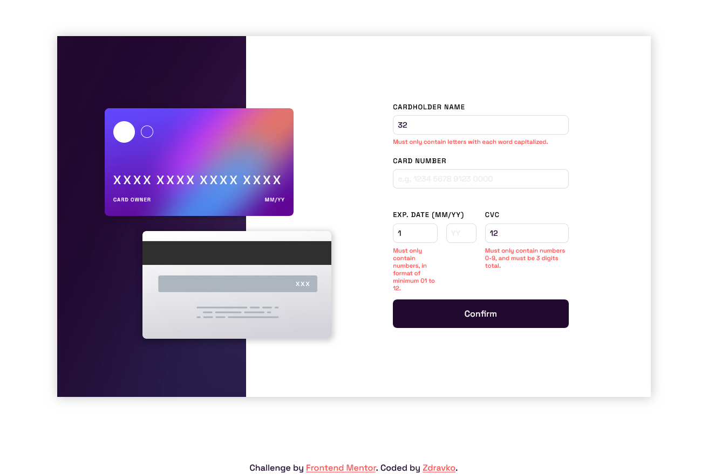

# Frontend Mentor - Interactive card details form solution

This is a solution to the [Interactive card details form challenge on Frontend Mentor](https://www.frontendmentor.io/challenges/interactive-card-details-form-XpS8cKZDWw). Frontend Mentor challenges help you improve your coding skills by building realistic projects. 

## Table of contents

- [Frontend Mentor - Interactive card details form solution](#frontend-mentor---interactive-card-details-form-solution)
  - [Table of contents](#table-of-contents)
  - [Overview](#overview)
    - [The challenge](#the-challenge)
    - [Screenshot](#screenshot)
    - [Links](#links)
  - [My process](#my-process)
    - [Built with](#built-with)
    - [What I learned](#what-i-learned)
    - [Useful resources](#useful-resources)
  - [Author](#author)

## Overview

### The challenge

Users should be able to:

- Fill in the form and see the card details update in real-time
- Receive error messages when the form is submitted if:
  - Any input field is empty
  - The card number, expiry date, or CVC fields are in the wrong format
- View the optimal layout depending on their device's screen size
- See hover, active, and focus states for interactive elements on the page

### Screenshot

### Links

- Solution URL: (https://github.com/Zdravko93/frontend_mentor_interactive-card-details-form)
- Live Site URL: (https://zdravko93.github.io/frontend_mentor_interactive-card-details-form/)

## My process

### Built with

- Semantic HTML5 markup
- CSS custom properties
- Flexbox
- Mobile-first workflow

### What I learned

- I learned a lot about RegEx, and its use cases
- I made progress in JavaScript abilities
- I reenforced what I learned so far, both in CSS and JavaScript and found new ways to implement different layouts
- Developed a keen eye for detail
- Gained valuable confidence in my abilities to keep me going, and always striving for more and always improve myself

### Useful resources

- [Stack Overflow](https://stackoverflow.com/) - This helped me a ton with my RegEx and form validation process. Clarified to me how often RegEx is being used in form validations, and I learned new ways to validate forms, and I can't wait to learn more about it

## Author

- Frontend Mentor - [@Zdravko93](https://www.frontendmentor.io/profile/Zdravko93)
- Github - [@Zdravko93](https://github.com/Zdravko93)

